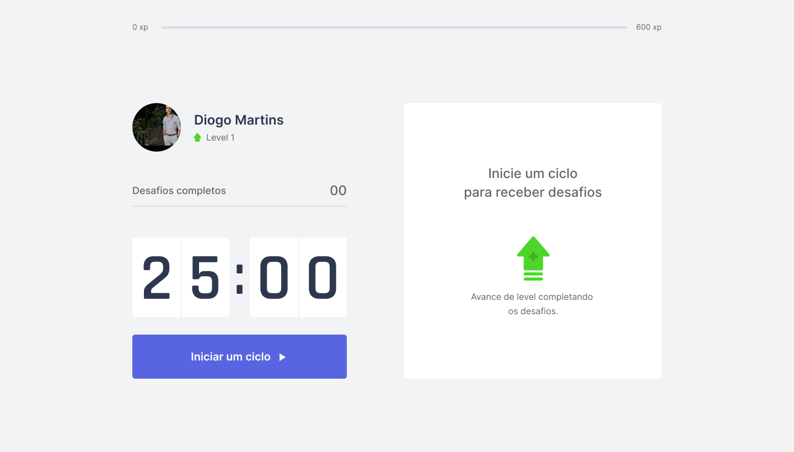
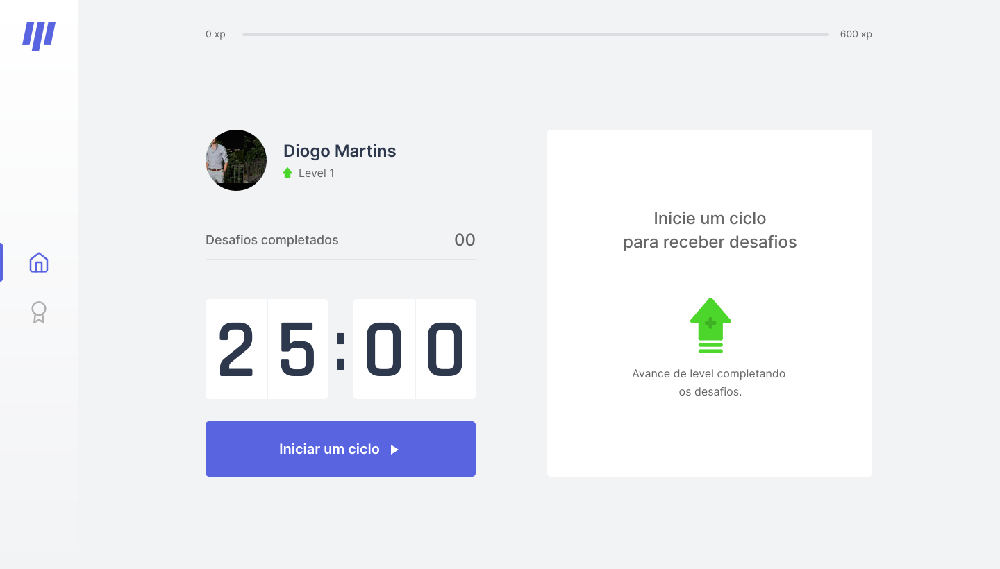

<!-- [![Contributors][contributors-shield]][contributors-url]
[![Forks][forks-shield]][forks-url]
[![Stargazers][stars-shield]][stars-url]
[![Issues][issues-shield]][issues-url]
[![MIT License][license-shield]][license-url]
[![LinkedIn][linkedin-shield]][linkedin-url] -->

<!-- PROJECT LOGO -->
 

  

  <h3 align="center">Projeto NLW</h3>

<!-- TABLE OF CONTENTS -->

  
Table of Contents

  <ol>
    <li>
      <a href="#about-the-project">About The Project</a>
    </li>
    <li><a href="#contact">Contact</a></li>
  </ol>

<!-- ABOUT THE PROJECT -->
## About The Project

Move.it is an App that uses the pomodoro technique, in order to improve your productivity and focus. Developed during Rocketseat's Next Level Week # 4.

  <h3><strong>Move.it 1.0</strong></h3>
  
  <h3><strong>Move.it 2.0</strong></h3>
  

<!-- CONTACT -->
## Contact

Diogo Martins - [Linkedin](https://www.linkedin.com/in/diogo-martins-b79b55182/)

Personal E-mail: [diogomartins200214@gmail.com](mailto:diogomartins200214@gmail.com)

